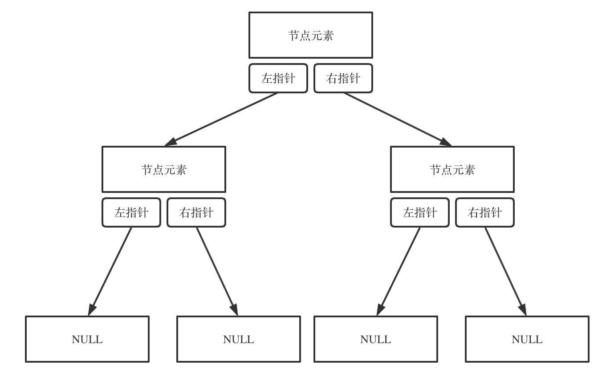

# 二叉树

## 理论基础

**满二叉树**：如果一棵二叉树只有度为0的结点和度为2的结点，并且度为0的结点在同一层上，则这棵二叉树为满二叉树。


**完全二叉树**：在完全二叉树中，除了最底层节点可能没填满外，其余每层节点数都达到最大值，并且最下面一层的节点都集中在该层最左边的若干位置。若最底层为第 h 层（h从1开始），则该层包含 1~ 2^(h-1) 个节点。


**二叉搜索树**：有数值的二叉树，是一个有序树。

- 若它的左子树不空，则左子树上所有结点的值均小于它的根结点的值；
- 若它的右子树不空，则右子树上所有结点的值均大于它的根结点的值；
- 它的左、右子树也分别为二叉排序树

**平衡二叉搜索树**：又被称为AVL（Adelson-Velsky and Landis）树，且具有以下性质：它是一棵空树或它的左右两个子树的高度差的绝对值不超过1，并且左右两个子树都是一棵平衡二叉树。


C++中map、set、multimap，multiset的底层实现都是平衡二叉搜索树，所以map、set的增删操作时间时间复杂度是`logn`。

> unordered_set, unordered_map 的底层实现是哈希表

**二叉树的存储方式**：二叉树可以链式存储，也可以顺序存储。

链式存储：


数组存储：

如果父节点的数组下标是 `i`，那么它的左孩子就是 `i * 2 + 1`，右孩子就是 `i * 2 + 2`。

二叉树主要有两种**遍历方式**：

1. **深度优先遍历**：先往深走，遇到叶子节点再往回走。
    1. 前序遍历（递归法，迭代法）：中左右
    2. 中序遍历（递归法，迭代法）：左中右
    3. 后序遍历（递归法，迭代法）：左右中
2. **广度优先遍历**：一层一层的去遍历。
    - 层次遍历（迭代法）

**二叉树的定义：**
```
struct TreeNode {
    int val;
    TreeNode *left;
    TreeNode *right;
    TreeNode(int x) : val(x), left(NULL), right(NULL) {}
};
```

## 二叉树的递归遍历

> 写递归的三个要素：  
确定递归函数的参数和返回值  
确定终止条件  
确定单层递归的逻辑

