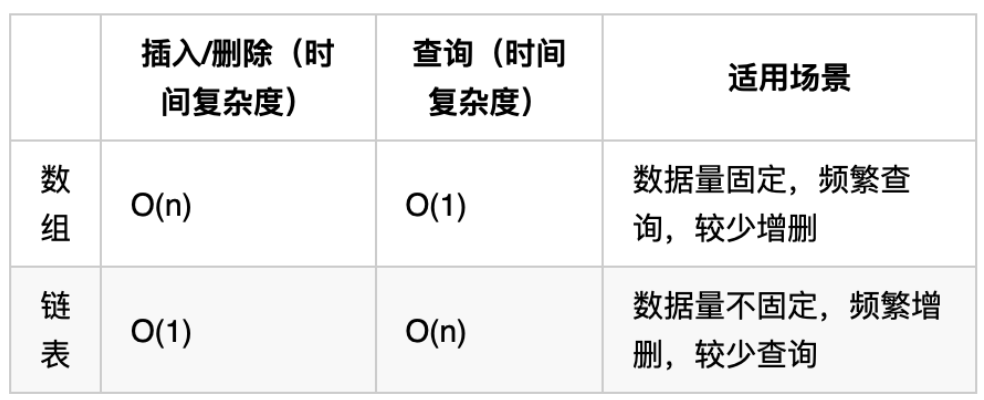

# 链表

## 基础知识

### 链表的类型

**单链表**：是一种通过指针串联在一起的线性结构，每一个节点由两部分组成，一个是数据域，一个是指针域（存放指向下一个节点的指针），最后一个节点的指针域指向null（空指针的意思）。

链表的入口节点称为链表的头结点也就是head。

**双链表**：每一个节点有两个指针域，一个指向下一个节点，一个指向上一个节点。

双链表 既可以向前查询也可以向后查询。

**循环链表**：就是链表首尾相连。

循环链表可以用来解决约瑟夫环问题。

### 链表的存储方式

数组是在内存中是连续分布的，但是链表在内存中可不是连续分布的。

链表是通过指针域的指针链接在内存中各个节点。

所以链表中的节点在内存中不是连续分布的 ，而是散乱分布在内存中的某地址上，分配机制取决于操作系统的内存管理。

### 链表的定义

```
// 单链表
struct ListNode {
    int val;  // 节点上存储的元素
    ListNode *next;  // 指向下一个节点的指针
    ListNode(int x) : val(x), next(NULL) {}  // 节点的构造函数
};
```

通过自己定义构造函数初始化节点：
```
ListNode* head = new ListNode(5);
```

使用默认构造函数初始化节点：
```
ListNode* head = new ListNode();
head->val = 5;
```

### 链表的操作

**删除节点**：将前一节点的`next`指针指向后一个节点，C++中还需要释放当前节点的内存。

**添加节点**：将前一节点的`next`指针指向新节点，新节点的`next`指针指向下一节点。

链表的增添和删除都是O(1)操作，也不会影响到其他节点。

但是要注意，要是删除第五个节点，需要从头节点查找到第四个节点通过next指针进行删除操作，查找的时间复杂度是O(n)。

### 性能分析



## 翻转链表（206）

可用递归，需要注意两点：
1. base case，也就是递归的终点情况；
2. 末尾`next`指针的情况处理。

先将复杂问题分解，化整为零。

## 双指针

**倒序查找链表**：先让一个快指针走若干步，再让慢指针开始移动，即可得到该位置。

**成环链表**：快指针每走2步，慢指针走1步。若双指针相遇，则有环。  
进阶：查找入环位置。双指针相遇后，将慢指针重置在head，两指针同速度前进，再次相遇即为入环位置。