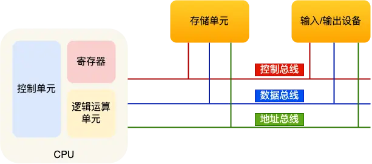
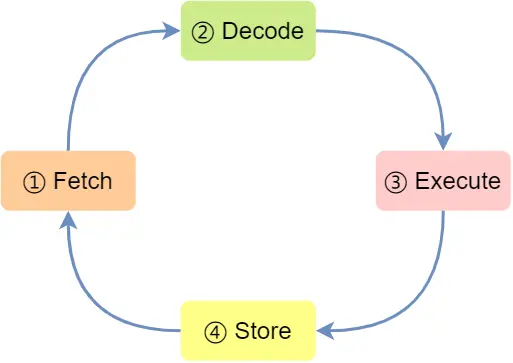
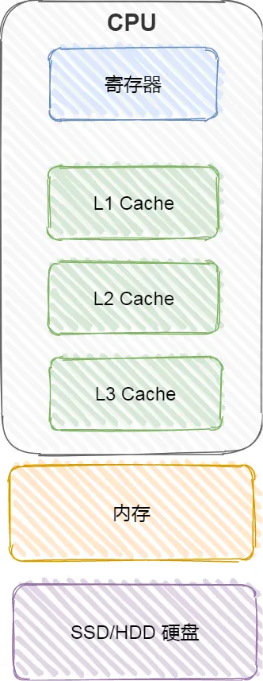
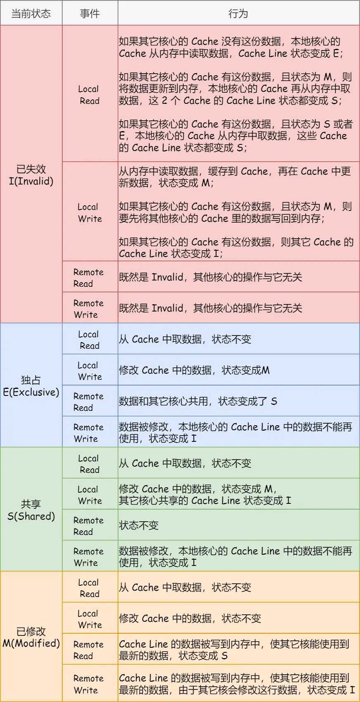

# 2.1 CPU 的执行

## 冯诺依曼模型

定义计算机基本结构为 5 个部分，分别是**运算器、控制器、存储器、输入设备、输出设备**，这 5 个部分也被称为冯诺依曼模型。

运算器、控制器是在中央处理器里的，存储器就我们常见的内存，输入输出设备则是计算机外接的设备，比如键盘就是输入设备，显示器就是输出设备。

### 中央处理器

32 位和 64 位 CPU 最主要区别在于一次能计算多少字节数据：

>32 位 CPU 一次可以计算 4 个字节；
64 位 CPU 一次可以计算 8 个字节。

这里的 32 位和 64 位，通常称为 CPU 的位宽，代表的是 CPU 一次可以计算（运算）的数据量。

CPU 内部还有一些组件，常见的有寄存器、控制单元和逻辑运算单元等。其中，控制单元负责控制 CPU 工作，逻辑运算单元负责计算，寄存器主要作用是存储计算时的数据，

常见的寄存器种类：

- 通用寄存器，用来存放需要进行运算的数据，比如需要进行加和运算的两个数据。
- 程序计数器，用来存储 CPU 要执行下一条指令「所在的内存地址」，注意不是存储了下一条要执行的指令，此时指令还在内存中，程序计数器只是存储了下一条指令「的地址」。
- 指令寄存器，用来存放当前正在执行的指令，也就是指令本身，指令被执行完成之前，指令都存储在这里。

### 总线

总线是用于 CPU 和内存以及其他设备之间的通信，总线可分为 3 种：

- 地址总线，用于指定 CPU 将要操作的内存地址；
- 数据总线，用于读写内存的数据；
- 控制总线，用于发送和接收信号，比如中断、设备复位等信号，CPU 收到信号后自然进行响应，这时也需要控制总线；

## 线路位宽与 CPU 位宽

为了避免低效率的串行传输的方式，线路的位宽最好一次就能访问到所有的内存地址。

CPU 想要操作「内存地址」就需要「地址总线」：

如果地址总线只有 1 条，那每次只能表示 「0 或 1」这两种地址，所以 CPU 能操作的内存地址最大数量为 `2（2^1）`个；
如果地址总线有 2 条，那么能表示 00、01、10、11 这四种地址，所以 CPU 能操作的内存地址最大数量为 `4（2^2）`个。
那么，想要 CPU 操作 4G 大的内存，那么就需要 32 条地址总线，因为 `2 ^ 32 = 4G`。

CPU 的位宽最好不要小于线路位宽，比如 32 位 CPU 控制 40 位宽的地址总线和数据总线的话，工作起来就会非常复杂且麻烦，所以 32 位的 CPU 最好和 32 位宽的线路搭配，因为 32 位 CPU 一次最多只能操作 32 位宽的地址总线和数据总线。

如果计算的数额不超过 32 位数字的情况下，32 位和 64 位 CPU 之间没什么区别的，只有当计算超过 32 位数字的情况下，64 位的优势才能体现出来。

32 位 CPU 最大只能操作 4GB 内存。而 64 位 CPU 寻址范围则很大，理论最大的寻址空间为 `2^64`。

硬件的 64 位和 32 位指的是 CPU 的位宽，软件的 64 位和 32 位指的是指令的位宽。

## 程序执行的基本过程

CPU 执行程序的过程如下：

- 第一步，CPU 读取「程序计数器」的值，这个值是指令的内存地址，然后 CPU 的「控制单元」操作「地址总线」指定需要访问的内存地址，接着通知内存设备准备数据，数据准备好后通过「数据总线」将指令数据传给 CPU，CPU 收到内存传来的数据后，将这个指令数据存入到「指令寄存器」。
- 第二步，「程序计数器」的值自增，表示指向下一条指令。这个自增的大小，由 CPU 的位宽决定，比如 32 位的 CPU，指令是 4 个字节，需要 4 个内存地址存放，因此「程序计数器」的值会自增 4；
- 第三步，CPU 分析「指令寄存器」中的指令，确定指令的类型和参数，如果是计算类型的指令，就把指令交给「逻辑运算单元」运算；如果是存储类型的指令，则交由「控制单元」执行；

简单总结一下就是，一个程序执行的时候，CPU 会根据程序计数器里的内存地址，从内存里面把需要执行的指令读取到指令寄存器里面执行，然后根据指令长度自增，开始顺序读取下一条指令。

CPU 从程序计数器读取指令、到执行、再到下一条指令，这个过程会不断循环，直到程序执行结束，这个不断循环的过程被称为 **CPU 的指令周期**。

## a = 1 + 2 执行具体过程

要想程序能跑起来，还需要把整个程序翻译成**汇编语言**的程序，这个过程称为编译成汇编代码。

针对汇编代码，我们还需要用汇编器翻译成机器码，这些机器码由 0 和 1 组成的机器语言，这一条条机器码，就是一条条的**计算机指令**，这个才是 CPU 能够真正认识的东西。

注意，内存中，数据和指令是分开区域存放的，存放指令区域的地方称为「正文段」。

上面的例子中，由于是在 32 位 CPU 执行的，因此一条指令是占 32 位大小，所以你会发现每条指令间隔 4 个字节。

而数据的大小是根据你在程序中指定的变量类型，比如 `int` 类型的数据则占 4 `个字节，char` 类型的数据则占 1 个字节。

### 指令

事实上指令的内容是一串二进制数字的机器码，每条指令都有对应的机器码，CPU 通过解析机器码来知道指令的内容。

不同的 CPU 有不同的指令集，也就是对应着不同的汇编语言和不同的机器码。

编译器在编译程序的时候，会构造指令，这个过程叫做指令的编码。CPU 执行程序的时候，就会解析指令，这个过程叫作指令的解码。

现代大多数 CPU 都使用来流水线的方式来执行指令，所谓的流水线就是把一个任务拆分成多个小任务，于是一条指令通常分为 4 个阶段，称为 4 级流水线。

四个阶段的具体含义：

1. CPU 通过程序计数器读取对应内存地址的指令，这个部分称为 `Fetch（取得指令）`；
2. CPU 对指令进行解码，这个部分称为 `Decode（指令译码）`；
3. CPU 执行指令，这个部分称为 `Execution（执行指令）`；
4. CPU 将计算结果存回寄存器或者将寄存器的值存入内存，这个部分称为 `Store（数据回写）`；

上面这 4 个阶段，我们称为`指令周期（Instrution Cycle）`，CPU 的工作就是一个周期接着一个周期，周而复始。

- 取指令的阶段，我们的指令是存放在**存储器**里的，实际上，通过程序计数器和指令寄存器取出指令的过程，是由**控制器**操作的；
- 指令的译码过程，也是由**控制器**进行的；
- 指令执行的过程，无论是进行算术操作、逻辑操作，还是进行数据传输、条件分支操作，都是由**算术逻辑单元**操作的，也就是由**运算器**处理的。但是如果是一个简单的无条件地址跳转，则是直接在**控制器**里面完成的，不需要用到运算器。

### 指令的类型

指令从功能角度划分，可以分为 5 大类：

- **数据传输类型的指令**，比如 `store/load` 是寄存器与内存间数据传输的指令，`mov` 是将一个内存地址的数据移动到另一个内存地址的指令；
- **运算类型的指令**，比如加减乘除、位运算、比较大小等等，它们最多只能处理两个寄存器中的数据；
- **跳转类型的指令**，通过修改程序计数器的值来达到跳转执行指令的过程，比如编程中常见的 `if-else`、`switch-case`、`函数调用`等。
- **信号类型的指令**，比如发生中断的指令 `trap`；
- **闲置类型的指令**，比如指令 `nop`，执行后 CPU 会空转一个周期；

### 指令的执行速度

CPU 的硬件参数都会有 `GHz` 这个参数，比如一个 1 GHz 的 CPU，指的是时钟频率是 1 G，代表着 1 秒会产生 1G 次数的脉冲信号，每一次脉冲信号高低电平的转换就是一个周期，称为时钟周期。

对于 CPU 来说，在一个时钟周期内，CPU 仅能完成一个最基本的动作，时钟频率越高，时钟周期就越短，工作速度也就越快。

程序执行的时候，耗费的 CPU 时间少就说明程序是快的，对于程序的 CPU 执行时间，我们可以拆解成 `CPU 时钟周期数（CPU Cycles）`和`时钟周期时间（Clock Cycle Time）`的乘积。

对于 CPU 时钟周期数我们可以进一步拆解成：「`指令数 x 每条指令的平均时钟周期数（Cycles Per Instruction，简称 CPI）`」。

因此，要想程序跑的更快，优化这三者即可：

- 指令数，表示执行程序所需要多少条指令，以及哪些指令。这个层面是基本靠编译器来优化。
- 每条指令的平均时钟周期数 CPI，表示一条指令需要多少个时钟周期数，现代大多数 CPU 通过流水线技术（Pipeline），让一条指令需要的 CPU 时钟周期数尽可能的少；
- 时钟周期时间，表示计算机主频，取决于计算机硬件。

# 2.2 存储器

## 存储器的层次结构

### 寄存器

最靠近 CPU 的控制单元和逻辑计算单元的存储器，就是寄存器，它使用的材料速度是最快的，因此价格也是最贵的。

寄存器的数量通常在几十到几百之间，每个寄存器可以用来存储一定的字节（byte）的数据。比如：

- 32 位 CPU 中大多数寄存器可以存储 `4` 个字节；
- 64 位 CPU 中大多数寄存器可以存储 `8` 个字节。

寄存器的访问速度非常快，一般要求在半个 CPU 时钟周期内完成读写，CPU 时钟周期跟 CPU 主频息息相关，比如 2 GHz 主频的 CPU，那么它的时钟周期就是 1/2G，也就是 0.5ns（纳秒）。

### CPU Cache

CPU Cache 用的是一种叫 `SRAM（Static Random-Access Memory，静态随机存储器）` 的芯片。

在 SRAM 里面，一个 bit 的数据，通常需要 6 个晶体管，所以 SRAM 的存储密度不高，同样的物理空间下，能存储的数据是有限的，不过也因为 SRAM 的电路简单，所以访问速度非常快。

CPU 的高速缓存，通常可以分为 L1、L2、L3 这样的三层高速缓存，也称为一级缓存、二级缓存、三级缓存。

#### L1 高速缓存

L1 高速缓存的访问速度几乎和寄存器一样快，通常只需要 `2~4` 个时钟周期，而大小在几十 KB 到几百 KB 不等。

每个 CPU 核心都有一块属于自己的 L1 高速缓存，指令和数据在 L1 是分开存放的，所以 L1 高速缓存通常分成**指令缓存**和**数据缓存**。

#### L2 高速缓存

L2 高速缓存同样每个 CPU 核心都有，但是 L2 高速缓存位置比 L1 高速缓存距离 CPU 核心 更远，它大小比 L1 高速缓存更大，CPU 型号不同大小也就不同，通常大小在几百 KB 到几 MB 不等，访问速度则更慢，速度在 `10~20` 个时钟周期。

#### L3 高速缓存

L3 高速缓存通常是多个 CPU 核心共用的，位置比 L2 高速缓存距离 CPU 核心 更远，大小也会更大些，通常大小在几 MB 到几十 MB 不等，具体值根据 CPU 型号而定。

访问速度相对也比较慢一些，访问速度在 `20~60` 个时钟周期。

### 内存

内存用的芯片和 CPU Cache 有所不同，它使用的是一种叫作 **DRAM （Dynamic Random Access Memory，动态随机存取存储器）** 的芯片。

DRAM 存储一个 bit 数据，只需要一个晶体管和一个电容就能存储，但是因为数据会被存储在电容里，电容会不断漏电，所以需要「定时刷新」电容，才能保证数据不会被丢失，这就是 DRAM 之所以被称为「动态」存储器的原因，只有不断刷新，数据才能被存储起来。

DRAM 的数据访问电路和刷新电路都比 SRAM 更复杂，所以访问的速度会更慢，内存速度大概在 `200~300` 个 时钟周期之间。

### SSD/HDD 硬盘

SSD（Solid-state disk） 就是我们常说的固体硬盘，结构和内存类似，但是它相比内存的优点是断电后数据还是存在的，而内存、寄存器、高速缓存断电后数据都会丢失。内存的读写速度比 SSD 大概快 10~1000 倍。

当然，还有一款传统的硬盘，也就是机械硬盘（Hard Disk Drive, HDD），它是通过物理读写的方式来访问数据的，因此它访问速度是非常慢的，它的速度比内存慢 10W 倍左右。

## 存储器的层次关系

每个存储器只和相邻的一层存储器设备打交道，并且存储设备为了追求更快的速度，所需的材料成本必然也是更高，也正因为成本太高，所以 CPU 内部的寄存器、L1\L2\L3 Cache 只好用较小的容量，相反内存、硬盘则可用更大的容量，这就我们今天所说的存储器层次结构。

存储层次结构也形成了**缓存**的体系。

# 2.3 CPU Cache

L1 Cache 和 L2 Cache 都是每个 CPU 核心独有的，而 L3 Cache 是多个 CPU 核心共享的。

程序执行时，会先将内存中的数据加载到共享的 L3 Cache 中，再加载到每个核心独有的 L2 Cache，最后进入到最快的 L1 Cache，之后才会被 CPU 读取。

其中，L1 Cache 通常会分为**数据缓存**和**指令缓存**，它两的大小通常是一样的。

CPU Cache 是由很多个 Cache Line 组成的，Cache Line 是 CPU 从内存读取数据的基本单位，而 Cache Line 是由各种标志（Tag）+ 数据块（Data Block）组成。

**直接映射 Cache（Direct Mapped Cache）**: 把内存块的地址始终「映射」在一个 CPU Cache Line（缓存块） 的地址，至于映射关系实现方式，则是使用「取模运算」，取模运算的结果就是内存块地址对应的 CPU Cache Line（缓存块） 的地址。

为了区别不同的内存块，在对应的 CPU Cache Line 中我们还会存储一个组标记（Tag）。这个组标记会记录当前 CPU Cache Line 中存储的数据对应的内存块，我们可以用这个组标记来区分不同的内存块。

除了组标记信息外，CPU Cache Line 还有两个信息：

一个是，从内存加载过来的实际存放数据（Data）。
另一个是，有效位（Valid bit），它是用来标记对应的 CPU Cache Line 中的数据是否是有效的，如果有效位是 0，无论 CPU Cache Line 中是否有数据，CPU 都会直接访问内存，重新加载数据。

CPU 在从 CPU Cache 读取数据的时候，并不是读取 CPU Cache Line 中的整个数据块，而是读取 CPU 所需要的一个数据片段，这样的数据统称为一个字（Word）。那怎么在对应的 CPU Cache Line 中数据块中找到所需的字呢？答案是，需要一个偏移量（Offset）。

因此，一个内存的访问地址，包括组标记、CPU Cache Line 索引、偏移量这三种信息，于是 CPU 就能通过这些信息，在 CPU Cache 中找到缓存的数据。而对于 CPU Cache 里的数据结构，则是由索引 + 有效位 + 组标记 + 数据块组成。

# 2.4 CPU 缓存一致性

数据写入 Cache 后，为了保证 Cache 和内存中的数据一致性，需要将数据写回内存。

## 写直达

把数据同时写入内存和 Cache 中。

## 写回

当发生写操作时，新的数据仅仅被写入 Cache Block 里，只有当修改过的 Cache Block「被替换」时才需要写到内存中。

## 缓存一致性

现在 CPU 都是多核的，由于 L1/L2 Cache 是多个核心各自独有的，那么会带来多核心的缓存一致性（Cache Coherence） 的问题，如果不能保证缓存一致性的问题，就可能造成结果错误。

同步不同核心的缓存数据：**写传播**和**事务的串行化(引入锁的概念)**。

## 总线嗅探

CPU 需要每时每刻监听总线上的一切活动，收到事件广播时，检查并更新该核心中已有的缓存数据。但加重了总线的负载。

## MESI 协议

- *Modified*，已修改
- *Exclusive*，独占
- *Shared*，共享
- *Invalidated*，已失效

# 2.5 CPU 执行任务

CPU 伪共享：多个线程同时读写同一个 Cache Line 的不同变量时，而导致 CPU Cache 失效的现象。

如何避免：使用宏定义 `__cacheline_aligned`，使得变量在 Cache Line 里面是对齐的。

## CPU 调度类别

- Deadline 调度：SCHED_DEADLINE
- Realtime 调度：SCHED_FIFO SCHED_RR
- Fair 调度（CFS 调度器）：SCHED_NORMAL SCHED_BATCH

## 完全公平调度(Completely Fair Schedule)

在 CFS 算法调度的时候，会优先选择 vruntime 少的任务。  
`虚拟运行时间 vruntime += 实际运行时间 delta_exec * NICE_0_LOAD / 权重`

## CPU 运行队列(Run Queue)

每个 CPU 都有自己的运行队列（Run Queue, rq），用于描述在此 CPU 上所运行的所有进程，其队列包含三个运行队列，Deadline 运行队列 dl_rq、实时任务运行队列 rt_rq 和 CFS 运行队列 cfs_rq，其中 cfs_rq 是用红黑树来描述的，按 vruntime 大小来排序的，最左侧的叶子节点，就是下次会被调度的任务。

# 2.6 软中断

Linux 系统为了解决中断处理程序执行过长和中断丢失的问题，将中断过程分成了两个阶段，分别是「上半部和下半部分」。

- 上半部用来快速处理中断，一般会暂时关闭中断请求，主要负责处理跟硬件紧密相关或者时间敏感的事情。
- 下半部用来延迟处理上半部未完成的工作，一般以「内核线程」的方式运行。

