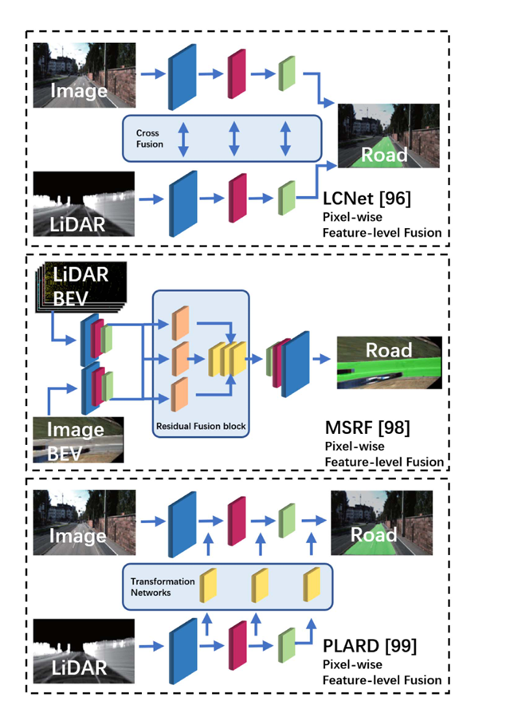

# Review

## 将点云和视觉图像融合的难点：

- 视觉图像是在一个平面上的，而点云保留了三维信息；
- 点云是无规则、离散、无序的，图像则相反。

---

## 处理点云的方法

- 基于体积的表示法：将点云按照网格划分，并在每个网格中手工提取特征。但缺点是会丢失精度，并且导致性能下降。
- 

# 要做的调研网络

# [LCNet](https://link.springer.com/article/10.1007/s10514-009-9113-3)

本文的模型可以用于检测地面上的多条车道，这是通过融合多个异步传感器流来实现的，并且对于障碍物等具有一定的健壮性。

LCNet 含有多个异构传感器，可以融合道路标点检测、障碍物检测、边缘检测等数据，实现中线追踪。

## 视觉线条匹配（使用滤波器滤出路面标点）

首先为图像的每一行配置一个一维滤波器，滤波器的宽度应与投影的画线标记的预期宽度一致。

首先使用水平和竖直算子提取边缘特征，标记离极值最近的点，并使用这些点拟合出线条。在拟合过程中，先选择离相机最近、最清晰的点，并在附近搜寻可能的匹配点，尝试沿着趋势**拟合曲线**，并计算其他可能点离曲线的距离，不断选择距离最近的点作为新的点，并重新绘制曲线，如此反复迭代，直到最后的点离趋势曲线较远，就结束寻找，记录曲线，并将涉及的特征点从待选点集合中删除，以免干扰下一条曲线的拟合。

对于较长的曲线，还会给予额外的得分奖励，鼓励向地平线延申的长曲线。

## 雷达探测

如果雷达回波高度有明显变化，则该位置存在垂直物体。

# [MSRF](https://www.sciencedirect.com/science/article/pii/S0020025517307119)

本文在条件混合场CRF(Conditional random field)的基础上，提出了一种新型混合CRF模型，用于融合摄像头和激光雷达信息。对齐激光雷达点和像素后，将像素和激光雷达点的标签（道路或背景）作为随机变量，并通过混合能量函数的最小化来推断标签。

大多数方法都是以摄像头或激光雷达为主导，未能充分发挥两种传感器的优势。例如，在 [43] 中，将激光雷达点云投影到图像上后，用于障碍物分类的特征主要是激光雷达点的高度信息，而忽略了像素信息。在 [21] 中，图像和激光雷达点云的信息是分阶段分别利用的。激光雷达点云仅用于地面种子提取，而接下来的道路检测和分割则以图像为主。在 [54] 中，融合是在特征和区域级别上进行的，结果是粗级别融合。所有这些方法都无法通过联合模型对图像和激光雷达进行细粒度融合。

## 图像和激光雷达点对齐

在激光雷达中的坐标点，需要将其转换为相机坐标。

$ p_c = \mathbf{R}_{rect} \mathbf{T}_{velo}^{cam} p $

其中，$ \mathbf{T}_{velo}^{cam} $ 是激光雷达坐标到相机坐标的变换矩阵， $ \mathbf{R}_{rect} $ 是旋转矫正矩阵。

在上一步变换后，z值为负的点被移除，剩下的点被投影矩阵 $ \mathbf{P}_{rect} $ 投射到图像平面上。

$ 
 \begin{bmatrix}
 u' & v' & w
 \end{bmatrix}^T = \mathbf{P}_{rect}
 \begin{bmatrix}
 x_c & y_c & z_c & 1
 \end{bmatrix}^T
$

在此例子中，投影出图像视场 FOV(field of view) 的点会被丢弃。

