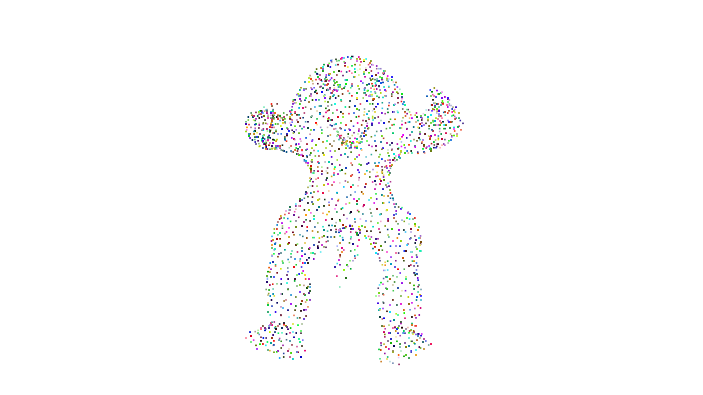
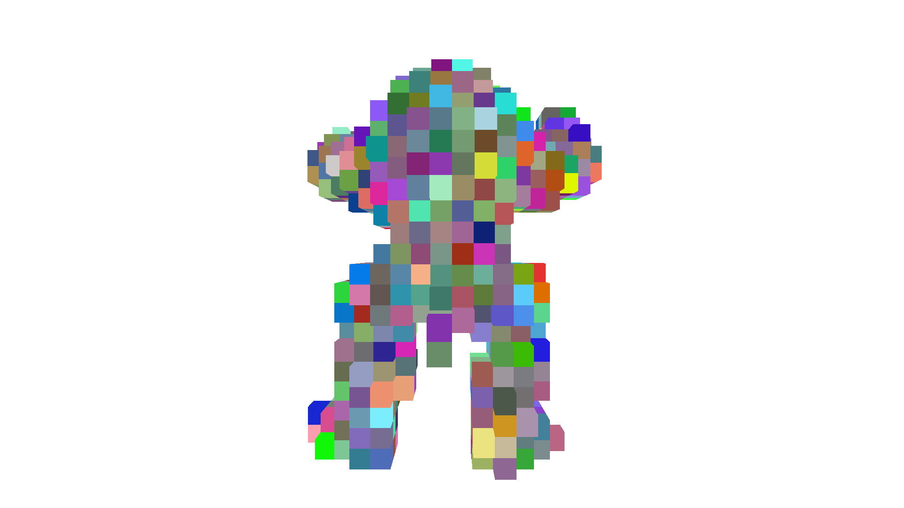

# 将点云和视觉图像融合的难点：

- 视觉图像是在一个平面上的，而点云保留了三维信息；
- 点云是无规则、离散、无序的，图像则相反。

---

# 处理点云的方法

- 基于体积的表示法：将点云按照网格划分，并在每个网格中手工提取特征。但缺点是会丢失精度，并且导致性能下降。
- 基于索引/树的表示法：根据区域中点的密度动态调整分辨率，在提取点特征的同时预建立树形结构。
- 基于二维视图的表示法：将点云投影到多个二维视图平面。因此，可以通过投影得到的多个二维视图进行常规卷积学习，但此方法丢失了三维特征。
- 基于图：将点云图当作图，直接使用 MLP 对邻域中的点进行卷积，并在拉普拉斯域进行频谱滤波。
- **基于点**：使用 MLP 直接开发基于点的卷积运算。(e.g. **PointNet**)

    - `PointNet`: 采用独立的 `T-Net` 模块来对齐点云，并使用共享的 `MLP` 处理单个点来逐点提取特征。其计算复杂度随着输入点云的规模而线性增长，更具扩展性。  
    提取过程表达式：$ g({x_1, \cdots, x_n}) \approx f_{sym}(h(x_1), \cdots, h(x_n)) $ ，其中，$ x $ 代表输入点云，$ h $ 代表点云特征提取函数（例如 MLP），$ f_{sym} $ 代表对称函数（例如 最大池化），$ g $ 则为表示该运算的近似函数。
    - `PointNet++`: 将点分成多组并局部应用 PointNet 来提取不同层次的特征，来提取不同层次的特征。  
    - `RandLA-Net`:  堆叠随机点采样模块和基于注意力的局部特征聚合模块，在高效率的前提下增加感受野。
    
---

# 深度补全
**目的**：将稀疏的点上采样为密集的规则点，使得全局点云分布尽可能均匀。

## 将相机和点云融合的方法
此方法的思想是， RGB 图像也包含 3D 几何物体的一些形状信息，因此可以使用 RGB 颜色图像作为深度信息上采样补全的指导。

[三维点云与可见光图像融合方法及可视化](https://www.researching.cn/ArticlePdf/m00002/2023/60/6/0628010.pdf)：提出了如何在相机和点云图之间，结合相机的内外参矩阵完成坐标转换，并取彩色图中对应的点颜色给点云着色。

1. 信号级融合：  
[Ma 等人](https://ieeexplore.ieee.org/abstract/document/8793637) 提出一种基于模型的自监督框架，仅需要图像序列和稀疏深度图像来进行训练。但此方法假设物体是静止的，且产生的深度输出是模糊的。  
[CSPN](https://openaccess.thecvf.com/content_ECCV_2018/html/Xinjing_Cheng_Depth_Estimation_via_ECCV_2018_paper.html) 能够提取与图像相关的亲和力矩阵(Affinity Matrix)；  
[CSPN++](https://ojs.aaai.org/index.php/AAAI/article/view/6635) 则动态选择卷积核大小和迭代次数，以及加权组合来提高性能。
2. 特征级融合：
[Jaritz 等人](https://ieeexplore.ieee.org/abstract/document/8490955/)提出了一种自动编码器网络，可以对稀疏的深度图进行补全；
[Wang 等人](https://ieeexplore.ieee.org/abstract/document/8794404) 设计了一种可积分模块，利用稀疏深度图来提高现有基于图像的深度预测网络的性能。该 PnP 模块利用稀疏深度计算出的梯度来更新现有深度预测网络生成的中间特征图；
[Eldesokey 等人](https://ieeexplore.ieee.org/abstract/document/8765412) 提出了一个用于无引导深度完成的框架，该框架并行处理图像和非常稀疏的深度图，并在共享解码器中合并它们。此外，使用归一化卷积来处理高度稀疏的深度并传播置信度。
[Valada 等人](https://link.springer.com/article/10.1007/s11263-019-01188-y) 将 one-stage 特征级融合扩展到网络不同深度的多个阶段。
[GuideNet](https://ieeexplore.ieee.org/abstract/document/9286883) 在编码器的不同阶段将图像特征与稀疏深度特征融合，以引导稀疏深度的上采样。
3. 多层次融合：
[Van Gansbeke 等人](https://ieeexplore.ieee.org/abstract/document/8757939/) 在图像引导的深度完成网络中进一步结合了信号级融合和特征级融合。该网络由一个全局分支和一个局部分支组成，用于并行处理RGB-D数据和深度数据，在基于置信度图的情况下之前融合它们。

---

# 动态物体检测

物体检测有两种主要方法：**顺序检测** 和 **单步检测(One-Stage)**。  
顺序检测的方法分为两步，即**提议阶段**和**边界框回归阶段**。提议阶段提出可能感兴趣的区域，回归阶段根据区域特征对提议进行分类。
单步法则并行处理二维和三维数据。

1. 基于 2D 提议的顺序检测模型
- 结果级融合：  
利用图像目标检测，将 2D 图像上的提议投射到 3D 点云空间，或将点云投射到 2D，再进行点云提议选择。  
[Frustum PointNets](https://openaccess.thecvf.com/content_cvpr_2018/html/Qi_Frustum_PointNets_for_CVPR_2018_paper.html): 从图像中生成 2D 边界框，然后投影到 3D 空间。  
[Du 等人](https://ieeexplore.ieee.org/abstract/document/8461232/)：在 2D -> 3D 提议生成阶段加入了一个额外的提议细化阶段。  
[RoarNet](https://ieeexplore.ieee.org/document/8813895)：在提议细化阶段引入神经网络。  
***以上方法的缺陷：是物体检测，对于多个细小物体分布的场景不适合。需要使用语义分割，并使用点级提议种子替换区域级提议种子。***  
[Yang 等人](https://arxiv.org/abs/1812.05276)：首先使用 2D 语义分割区分背景点，并将点投影到图像平面，将点和 2D 语义标签相关联。然后使用两个 PointNet++ 进行提议和预测。  
- 多级融合：  
将结果级融合与特征级融合结合起来。  
[PointFusion](https://ieeexplore.ieee.org/document/8578131)：首先基于 2D 图像生成边界框，这些边界框用来将点投影到图像平面，并选择对应的点。最后，一个基于 ResNet 和 PointNet 的网络结合图像和点云特征来估计 3D 对象。图像特征和点云特征在提议级别融合，用于最终的3D对象检测，有助于 3D 边界框回归。  
[SIFRNet](https://ojs.aaai.org/index.php/AAAI/article/view/4963)：首先从图像中生成视锥提议，然后在视锥提议中提取点云特征，并和对应的图像特征结合，以用于 3D 回归。
- 特征级融合：  
**早期的多模态融合将 3D 特征作为图像的附加通道添加到图像中，原理是将三维几何体投影到图像平面上，结果输出也是在图像平面上，这不是理想的 3D 空间中定位对象的方法。**  
[DepthRCNN](https://link.springer.com/chapter/10.1007/978-3-319-10584-0_23)：将来自摄像头的三维几何图形编码在图像的 RGB 通道中，其中包括水平视差、离地高度和与重力的夹角（HHA）。  
[Gupta 等人](https://openaccess.thecvf.com/content_cvpr_2015/html/Gupta_Aligning_3D_Models_2015_CVPR_paper.html)：扩展了DepthRCNN，通过对齐 3D CAD 模型，取得了显著的性能提升。  
[Schlosser](https://ieeexplore.ieee.org/abstract/document/7487370/)：进一步在2D CNNs上利用学习RGB-HHA表示进行行人检测。作者还注意到，如果RGB和HHA的融合发生在网络的更深层次，可以达到更好的结果。  
***密集RGB与稀疏深度之间的分辨率不匹配意味着只有一小部分像素有对应的点。因此，直接将RGB信息附加到点上会导致大部分纹理信息的丢失，使融合变得毫无意义。以下研究则致力于缓解这一问题。***  
[Pointpainting](https://openaccess.thecvf.com/content_CVPR_2020/html/Vora_PointPainting_Sequential_Fusion_for_3D_Object_Detection_CVPR_2020_paper.html)：在每点融合之前提取高级图像语义，遵循了在[Yang 等人](https://arxiv.org/abs/1812.05276)中将点投影到 2D 语义图的思想。但是，本文没有使用 2D 语义来过滤非对象点，而是简单地将 2D 语义作为附加通道附加到点云上。  

2. 基于 3D 提议的顺序检测模型  
**在基于 3D 提议的顺序模型中，3D 提议直接从 2D 或 3D 数据生成。 2D 到 3D 提议转换的移除大大缩小了 3D 对象检测的 3D 搜索空间。3D 提议生成的常用方法包括多视图方法和点云体素化方法。**  
**在多视图的方案中，鸟瞰图是首选项，因为它避免了遮挡，并且能够直接获取到原始的 x, y 坐标信息。**  
**点云体素化将连续的不规则数据结构转换为离散的规则数据结构。这使得可以应用标准的3D离散卷积并利用现有网络结构来处理点云。缺点是一些空间分辨率的损失，这可能包含细粒度的3D结构信息。**  

> 点云体素化指的是将点云表示的物体形状用一系列像素方块表示，这有利于点云在内存中有序存储，并且可以高效地应用空间卷积。  

|input|voxelization|
|---|---|
|||

- 特征级融合：  
[MV3D](https://openaccess.thecvf.com/content_cvpr_2017/html/Chen_Multi-View_3D_Object_CVPR_2017_paper.html)：MV3D在像素化的自上而下的激光雷达特征图（高度、密度和强度）上生成3D提议。这些3D候选项随后被投影到激光雷达正视图和图像平面上，以提取和融合区域级特征进行边界框回归。融合发生在感兴趣区域（ROI）级别，通过ROI池化。  
[AVOD](https://ieeexplore.ieee.org/abstract/document/8594049):利用图像特征和鸟瞰点云改进了 MV3D 的提议阶段；并采用了自动编码器架构将最终特征图上采样到原始尺寸。  
[Lu 等人](https://ieeexplore.ieee.org/abstract/document/8682746)：使用了一种基于编码器-解码器的提议网络，配备了空间-通道注意力模块(SCA)和扩展空间上采样模块(ESU)。SCA可以捕获多尺度上下文信息，而ESU恢复空间信息。  
**以对象为中心的融合方法(MV3D, AVOD)在 ROI 汇集过程中会丢失细粒度的几何信息。**  
[ContFuse](https://openaccess.thecvf.com/content_ECCV_2018/html/Ming_Liang_Deep_Continuous_Fusion_ECCV_2018_paper.html):通过点对点融合解决了这种信息丢失，这种融合是通过在网络的多个阶段使用连续卷积融合层实现的。这些融合层桥接了不同尺度的图像和点云特征。然而，当激光雷达点稀疏时，点融合可能无法充分利用高分辨率图像。  
[Liang 等人](https://openaccess.thecvf.com/content_CVPR_2019/html/Liang_Multi-Task_Multi-Sensor_Fusion_for_3D_Object_Detection_CVPR_2019_paper.html)：结合多种融合方法进一步扩展了点对点融合，例如信号级融合（RGB-D）、特征级融合、多视图和深度补全。特别是，深度补全使用图像信息对稀疏深度图进行上采样，生成密集的伪点云。这一上采样过程缓解了稀疏点对点融合问题，有助于学习跨模态表示。  
[MVX-Net](https://ieeexplore.ieee.org/abstract/document/8794195): 介绍了两种融合点云和图像的方法，分别是点融合和体素化融合。这两种方法都采用了预训练的 2D CNN 来提取图像特征，并使用基于 VoxelNet 的网络从融合后的点云中估计对象。在点对点融合方法中，首先将点云投影到图像特征空间以提取图像特征，然后进行体素化并由 VoxelNet 处理。体素化融合方法首先将点云体素化，然后将非空体素投影到图像特征空间进行体素/区域级特征提取。  
**将体素化点云和图像结合最简单的方法是将RGB信息作为体素的额外通道附加上去。**  
[Song and Xiao](https://link.springer.com/chapter/10.1007/978-3-319-10599-4_41)：通过在体素化点云上滑动3D检测窗口实现了3D对象检测。  
[Song 等人](https://openaccess.thecvf.com/content_cvpr_2016/html/Song_Deep_Sliding_Shapes_CVPR_2016_paper.html)：进一步扩展了上一条的想法，使用 3D 离散卷积。在第一阶段，体素化点云（从 RGB-D 数据生成）首先被多尺度 3D 区域提议网络处理，用于 3D 提议生成。这些候选项随后被联合对象识别网络分类，该网络同时接受图像和体素化点云作为输入。  
**然而，体积表示引入了边界伪影并破坏了细粒度的局部几何。其次，图像与体素化点云之间的分辨率不匹配使得融合效率低下。**  

3. 单步模型  
**一步式模型在单一阶段内执行提议生成和边界框回归。通过将提议和边界框回归阶段融合为一步，这些模型通常更具计算效率。这使得它们更适合于移动计算平台上的实时应用。**  
[Meyer 等人](https://openaccess.thecvf.com/content_CVPRW_2019/html/WAD/Meyer_Sensor_Fusion_for_Joint_3D_Object_Detection_and_Semantic_Segmentation_CVPRW_2019_paper.html) 将 [LaserNet](https://openaccess.thecvf.com/content_CVPR_2019/html/Meyer_LaserNet_An_Efficient_Probabilistic_3D_Object_Detector_for_Autonomous_Driving_CVPR_2019_paper.html) 扩展为多任务和多模态网络，在融合图像和激光雷达数据上执行 3D 对象检测和 3D 语义分割。两个 CNN 并行处理深度图像（由点云生成）和正视图，并通过将点投影到图像平面上来融合它们。这个特征图被输入到 LaserNet 中，以预测边界框每个点的分布，并将它们组合起来形成最终的 3D 提议。

---

# 静态物体检测

## [LCNet](https://link.springer.com/article/10.1007/s10514-009-9113-3)

本文的模型可以用于检测地面上的多条车道，这是通过融合多个异步传感器流来实现的，并且对于障碍物等具有一定的健壮性。

LCNet 含有多个异构传感器，可以融合道路标点检测、障碍物检测、边缘检测等数据，实现中线追踪。

### 视觉线条匹配（使用滤波器滤出路面标点）

首先为图像的每一行配置一个一维滤波器，滤波器的宽度应与投影的画线标记的预期宽度一致。

首先使用水平和竖直算子提取边缘特征，标记离极值最近的点，并使用这些点拟合出线条。在拟合过程中，先选择离相机最近、最清晰的点，并在附近搜寻可能的匹配点，尝试沿着趋势**拟合曲线**，并计算其他可能点离曲线的距离，不断选择距离最近的点作为新的点，并重新绘制曲线，如此反复迭代，直到最后的点离趋势曲线较远，就结束寻找，记录曲线，并将涉及的特征点从待选点集合中删除，以免干扰下一条曲线的拟合。

对于较长的曲线，还会给予额外的得分奖励，鼓励向地平线延申的长曲线。

### 雷达探测

如果雷达回波高度有明显变化，则该位置存在垂直物体。

## [MSRF](https://www.sciencedirect.com/science/article/pii/S0020025517307119)

本文在条件混合场CRF(Conditional random field)的基础上，提出了一种新型混合CRF模型，用于融合摄像头和激光雷达信息。对齐激光雷达点和像素后，将像素和激光雷达点的标签（道路或背景）作为随机变量，并通过混合能量函数的最小化来推断标签。

大多数方法都是以摄像头或激光雷达为主导，未能充分发挥两种传感器的优势。例如，在 [43] 中，将激光雷达点云投影到图像上后，用于障碍物分类的特征主要是激光雷达点的高度信息，而忽略了像素信息。在 [21] 中，图像和激光雷达点云的信息是分阶段分别利用的。激光雷达点云仅用于地面种子提取，而接下来的道路检测和分割则以图像为主。在 [54] 中，融合是在特征和区域级别上进行的，结果是粗级别融合。所有这些方法都无法通过联合模型对图像和激光雷达进行细粒度融合。

### 图像和激光雷达点对齐

在激光雷达中的坐标点，需要将其转换为相机坐标。

$ p_c = \mathbf{R}_{rect} \mathbf{T}_{velo}^{cam} p $

其中，$ \mathbf{T}_{velo}^{cam} $ 是激光雷达坐标到相机坐标的变换矩阵， $ \mathbf{R}_{rect} $ 是旋转矫正矩阵。

在上一步变换后，z值为负的点被移除，剩下的点被投影矩阵 $ \mathbf{P}_{rect} $ 投射到图像平面上。

$ 
 \begin{bmatrix}
 u' & v' & w
 \end{bmatrix}^T = \mathbf{P}_{rect}
 \begin{bmatrix}
 x_c & y_c & z_c & 1
 \end{bmatrix}^T
$

在此例子中，投影出图像视场 FOV(field of view) 的点会被丢弃。

---

# 语义分割

---

# 思路

可以分为二步，先使用识别分支识别物体轮廓，再使用回归分支细化轮廓的位置和形状。
此方法需要人工对数据集图片中的轮廓进行标注。

难点：数据集场景和实际场景的物体差别，导致不能较好地分割。